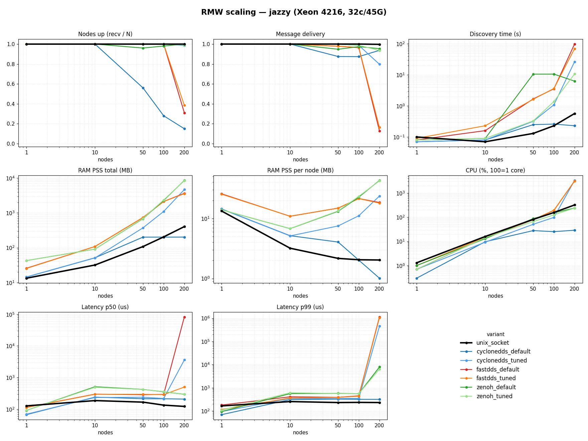
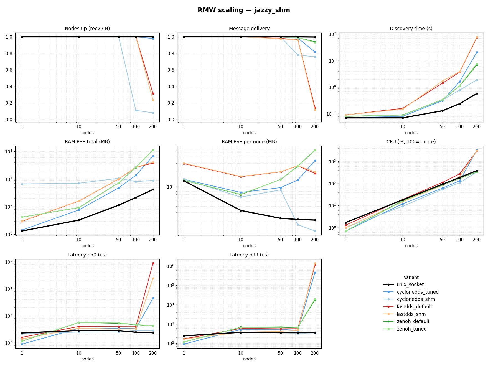

# ros2_rmw_benchmark

The only RMW we tested that stays healthy at 200 nodes on one host.

This repo compares four ROS 2 RMW implementations on a single machine, localhost only, from 1 to 200 nodes, on ROS 2 Jazzy. The one under test is `rmw_unix_socket_cpp`. It uses AF_UNIX datagram sockets for transport (a local socket the kernel routes without the TCP/IP stack), plus a lock-free shared-memory registry for discovery (a small table in POSIX shared memory that every process maps to find its peers). No DDS, no daemon, no master, no broker. We wrote it, so keep that in mind. The numbers below come from one command. You should run it yourself.

## What and why

Many ROS 2 systems are really just a lot of processes on one box talking to each other. On our boat that is 150+ nodes on a single host. The DDS stacks that ROS 2 ships were built for distributed systems first. On a dense single-host graph that shows up as CPU burn, growing RAM, and discovery (the step where nodes find each other) that quietly stops converging once you pass about 50 to 100 nodes. ROS 1 had the master and TCPROS. ROS 2 dropped the single master for a discovery protocol that, on one host at scale, costs more than people expect.

`rmw_unix_socket_cpp` takes the other road. Transport is plain AF_UNIX datagrams: the kernel loopback path without TCP/IP on top. Discovery is a shared-memory table that every process maps. There is no extra process to launch and nothing to keep alive. That buys nothing across a network. It cannot reach another machine, so cross-host traffic has to go through a bridge such as Zenoh. And at small node counts the mature DDS stacks tie or beat it on raw 1:1 latency. The story here is what happens as N grows.

## The four RMWs and the matrix

| RMW | default | tuned | shm |
|---|---|---|---|
| `rmw_unix_socket_cpp` (under test) | yes | — | — |
| `rmw_cyclonedds_cpp` | yes | `cyclonedds_tuned.xml` | `cyclonedds_shm.xml` (Iceoryx + iox-roudi) |
| `rmw_fastrtps_cpp` (Fast DDS) | yes | `fastdds_tuned.xml` (mutation_tries=1000) | `fastdds_shm.xml` (data-sharing) |
| `rmw_zenoh_cpp` | yes | `zenoh_tuned` (SHM via `ZENOH_CONFIG_OVERRIDE`) | tuned is the SHM variant |

The variant keys the scripts use: `unix_socket`, `cyclonedds_default`, `cyclonedds_tuned`, `cyclonedds_shm`, `fastdds_default`, `fastdds_tuned`, `fastdds_shm`, `zenoh_default`, `zenoh_tuned`. What each flag does, why, and where it comes from is in [CONFIGS.md](CONFIGS.md).

## The workload

A ring of N processes, one ROS node each. Node *i* publishes a timestamped message on `/bench/t<i>` at a fixed rate and subscribes to node *i-1*. Same QoS for everyone (reliable, keep-last-10) and the same message for every RMW. Latency is measured in C++ (rclcpp) with `CLOCK_MONOTONIC`, which is system-wide on Linux, so timestamps from two processes compare directly on one host.

Two message sizes:

- **string run** — a 256-byte `std_msgs/String`.
- **shm run** — a fixed 64 KB `bench_nodes/FixedMsg`, sized so DDS zero-copy (sending without copying the payload) can turn on.

The metrics, in short:

- **nodes up** — the share of N nodes that ever received from their ring neighbour. Trust this one first. A stack whose processes never started cannot be judged on RAM or latency.
- **msg delivery** — received divided by sent, counted only among the nodes that ran.
- **RAM as PSS** (proportional set size) — shared library pages counted once across processes. RSS double-counts shared libraries when you have many processes; PSS is the fair number.
- **CPU %** — 100 means one full core.
- **discovery time** — launch until every node is receiving.
- **p50 / p99 latency** — the median and the 99th percentile, in microseconds.

## Quickstart

One command. It builds the Docker image, runs both matrices, and writes the graphs and `results/system.md`:

```sh
bash scripts/run_benchmark.sh
```

Prereqs: Docker, internet (the build clones CycloneDDS, Zenoh, and `rmw_unix_socket_cpp` and compiles zenoh-c with cargo), and this repo.

Quick run, just two node counts and the string phase:

```sh
NODES="1 10" PHASES=string bash scripts/run_benchmark.sh
```

## Results

The two charts below are the quickest way to read the whole sweep. Each one has
four panels — nodes up, total RAM, CPU, and tail latency — plotted against node
count for every RMW, so you can see exactly where each one starts to diverge as
the graph grows. `unix_socket` is the thick black line; watch how flat it stays
while the others bend upward past 50–100 nodes.

**256-byte string run** (the main comparison):



**64 KB SHM run** (gives the DDS zero-copy paths their best case):



The headline is the 200-node column of the string run. Every curve leads here:

| RMW (200 nodes, string run) | nodes up | msg delivery | total PSS MB | CPU % | p50 µs | p99 µs |
|---|---|---|---|---|---|---|
| `unix_socket` | 1.00 | 0.998 | 405.3 | 318 | 123 | 230 |
| `cyclonedds_default` | 0.15 | 0.906 | 202.1 | 26 | 208 | 323 |
| `cyclonedds_tuned` | 0.97 | 0.794 | 4617.0 | 3335 | 3823 | ~454000 |
| `fastdds_default` | 0.27 | 0.108 | 3418.5 | 3141 | 350 | ~1880000 |
| `fastdds_tuned` | 0.27 | 0.141 | 3405.2 | 3140 | 357 | ~869000 |
| `zenoh_default` | 0.99 | 0.957 | 8553.9 | 242 | 295 | ~5000 |
| `zenoh_tuned` | 0.98 | 0.919 | 8673.1 | 239 | 295 | ~4000 |

Cyclone's flat RAM and CPU at default are survivors-only: most of its nodes never came up, so there is little left running to measure. Fast DDS tuned is now simple discovery + `mutation_tries=1000` (the Discovery Server it used to run collapses at this scale — see CONFIGS.md): it is clean to 100 nodes, then the O(N²) discovery storm caps it at ~27% up at 200. For the per-node-count tables, the 64 KB run, and the reasoning behind each row, see [RESULTS.md](RESULTS.md).

## Findings

Only `unix_socket` stays healthy at 200 nodes: all 200 up, 99.8% delivery, p50 123 µs and p99 230 µs — flat from 1 to 200 nodes — at 405 MB PSS and 318% CPU.

The DDS stacks each fail in their own way. Cyclone at default brings up 14.5% of nodes (60% at 50, 27% at 100). Tuned gets 97% up, but delivery drops to 79%, p99 climbs to about 0.45 s, and it costs 4.6 GB and 3335% CPU. Fast DDS, both default and tuned, brings up ~27% at 200 with a p99 of one to two seconds; tuned (simple discovery + mutation_tries=1000) is clean to 100 nodes, then the discovery storm caps it. Zenoh comes closest on bring-up — 99% at default, 98% tuned — at 92 to 96% delivery, but p99 in the single-digit milliseconds and RAM about 8.5 GB.

At 1 and 10 nodes the picture flips in places. Cyclone and Fast DDS post lower p50 latency than `unix_socket`, and Cyclone uses less RAM. That is the honest small-N result. The difference is that `unix_socket`'s curves stay flat while the others bend.

### The SHM caveat, plainly

The 64 KB run lets the zero-copy paths turn on: Cyclone + Iceoryx, Fast DDS data-sharing, Zenoh SHM. Comparing those against an AF_UNIX RMW on large messages is not a fair fight. Zero-copy skips the payload copy, so on big payloads it wins on raw transfer. That is expected and not the point. We include the 64 KB run to be fair to the DDS stacks, and the result is that SHM does not fix the at-scale problem. Cyclone + Iceoryx bring-up collapses past about 50 nodes (11% up at 100, 8% at 200) and adds a fixed ~640 MB iox-roudi pool from the first node. Fast DDS data-sharing changed nothing measurable — the limit is discovery, not the copy. Zenoh SHM did not clearly help the tail (about 20 ms at 200). Zero-copy really pays off for megabyte-scale messages such as camera and lidar frames, which are past the ~400 KB AF_UNIX datagram cap (two times `net.core.wmem_max`) and out of scope here. We do not claim `unix_socket` beats zero-copy on large transfers. It does not, and it is not trying to.

## Related work

ROS 1 had a Unix-domain-socket transport for `ros_comm`, written by Tomoya Fujita, a Sony engineer (built at Sony, used on the aibo robot). The PR — [ros/ros_comm #1510, "Unix Domain Socket Support"](https://github.com/ros/ros_comm/pull/1510) — was closed and never merged. It lives on [his fork](https://github.com/fujitatomoya/ros_comm) on branch `topic-noetic-devel-uds-support`, and there is a ROSCon 2018 talk, "aibo with ROS" ([slides](https://roscon.ros.org/2018/presentations/ROSCon2018_Aibo.pdf), [video](https://vimeo.com/293292255)). That work skipped the TCP/IP loopback stack but was not zero-copy — it still copied through the kernel and reused TCPROS framing — and still used the ROS master for discovery. Its micro-bench on Skylake showed UDS-stream at 1.82 µs vs TCP at 3.14 µs for a 100-byte message, and about 8% lower average latency on a HelloWorld. ROS 1 is end-of-life as of May 31 2025, so this is a precedent to cite, not reusable code.

As far as we can tell, no ROS 2 RMW uses AF_UNIX sockets. The ROS 2 world went to shared memory instead. So `rmw_unix_socket_cpp` (AF_UNIX datagram plus SHM discovery) sits at its own point in the design space, with the ROS 1 UDS work as its closest ancestor. Worth a look if you are in this area: [ZeroDDS](https://github.com/zero-objects/zero-dds), a recent pure-Rust RMW for ROS 2 ([Discourse thread](https://discourse.openrobotics.org/t/zerodds-a-pure-rust-rmw-for-ros-2-rc-3-built-against-349-real-ros-dds-pain-reports/55581), a few weeks old).

## Reproduce and layout

`bash scripts/run_benchmark.sh` is the whole thing. Underneath:

- `bench_nodes/` — the C++ ament package: the load node and `msg/FixedMsg.msg`.
- `configs/` — `cyclonedds_tuned.xml`, `cyclonedds_shm.xml`, `fastdds_tuned.xml`, `fastdds_shm.xml`, `iox_roudi_config.toml`.
- `docker/` — `Dockerfile`, `entrypoint.sh`.
- `scripts/` — `run_benchmark.sh`, `run_one.py`, `rmw_matrix.py`, `measure.py`, `aggregate.py`, `plot.py`, `sysinfo.sh`, `clean.sh`.
- `results/` — `jazzy/` (256 B), `jazzy_shm/` (64 KB), `graphs/`, `system.md`.

The test host is an Intel Xeon Silver 4216 at 2.10 GHz, 32 logical CPUs, 45 GiB RAM, Ubuntu 24.04.4, Linux 6.8, `/dev/shm` 23G, `net.core.wmem_max` 212992. These results were measured on a CI box. The exact figures, written by `scripts/sysinfo.sh` on the run, are in [results/system.md](results/system.md).

Versions, as tested: ROS 2 Jazzy. CycloneDDS core 0.10.5 (tag) with `rmw_cyclonedds` jazzy branch, from source. `rmw_zenoh` jazzy branch (zenoh_cpp_vendor 0.2.9, Rust 1.75), from source. `rmw_fastrtps_cpp` from the Jazzy apt package, not source, to avoid ABI skew with the apt fastcdr/typesupport that `bench_nodes` and `rmw_unix_socket_cpp` link against. `rmw_unix_socket_cpp` cloned from [GitHub](https://github.com/benaliabderrahmane/rmw_unix_socket_cpp) at branch `main`.

## Honest limits

`rmw_unix_socket_cpp` is alpha and has one maintainer. It is localhost-only by design; cross-host goes through a bridge. It passes the rmw conformance suite and about 90 of its own tests, but it is not safety-certified. It has a per-message size cap of about 400 KB (the AF_UNIX datagram limit, which is two times `net.core.wmem_max`; raise `net.core.wmem_max` and `net.core.rmem_max` for larger), and it does not aim to beat shared-memory DDS at raw 1:1 latency. This benchmark is synthetic ring traffic at one rate and size on one host — a scaling comparison, not a final verdict. Nothing here says anything about multi-host.

## See also

- [RESULTS.md](RESULTS.md) — the full writeup, per-node-count tables, both runs.
- [CONFIGS.md](CONFIGS.md) — tuned-config provenance: what, why, source, effect.
- [CONTRIBUTING.md](CONTRIBUTING.md) — how to add an RMW or a workload.
- [LICENSE](LICENSE) — Apache-2.0.
