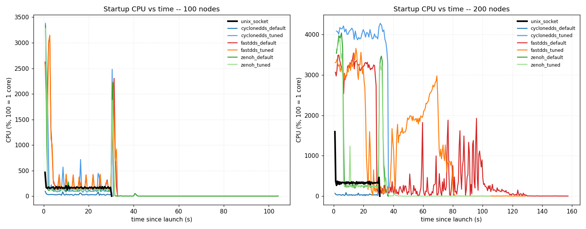
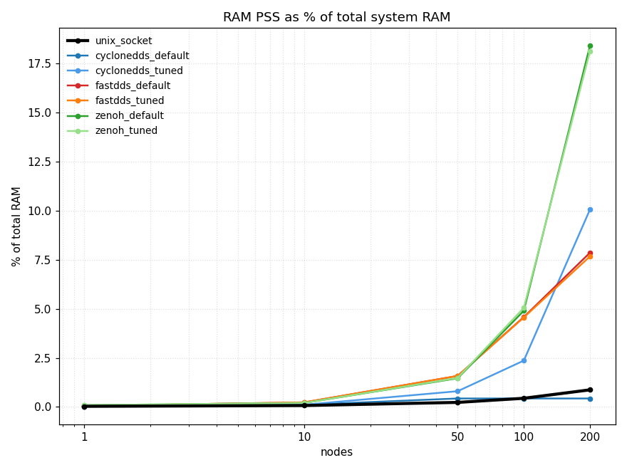

# Results

This is the full writeup behind the README. If you only want the headline, the README has it. This file has the method, every table, and a short plain read of what each RMW did.

Everything here is one run on one host, ROS 2 Jazzy, localhost only. The 256-byte run is in `results/jazzy/`. The 64 KB run is in `results/jazzy_shm/`. The two graphs below come from those directories.

Short version: at 200 nodes on one host, `rmw_unix_socket_cpp` is the only stack where all 200 nodes start and stay healthy. All 200 up, 99.7% delivery, p50 123 us, p99 230 us, flat from 1 to 200 nodes, at 406 MB RAM and 322% CPU. The DDS stacks do one of two things. Either they fail to start their nodes (Cyclone default 15% up, Fast DDS ~31-38% up at 200). Or they stay up but pay a high price: tail latency from hundreds of milliseconds up to seconds, and RAM in the gigabytes (Cyclone tuned, Zenoh). Zenoh comes closest on bring-up (99-100% up) but at single-digit-ms tails and ~8.6 GB. The rest of this file is the evidence.

## Methodology

### Workload

A ring of N processes, one ROS node each. Node *i* sends a message on `/bench/t<i>` at a fixed rate and subscribes to node *i-1*. Node 0 closes the ring by subscribing to node *N-1*. Each node is its own OS process. So N=200 means 200 processes, plus any discovery daemon the RMW needs.

QoS is the same for every RMW and every run: reliable, keep-last-10. The message is the same too. There are two message sizes:

- The **string** run: a 256-byte `std_msgs/String`. This is the small-message case.
- The **shm** run: a fixed 64 KB `bench_nodes/FixedMsg`. This is a fixed-size type. The DDS zero-copy paths need a fixed-size type before they turn on. The point of this run is to be fair to the DDS stacks (see the shared-memory section).

Latency is measured in C++ (rclcpp) using `CLOCK_MONOTONIC`. That clock only moves forward and is not affected by NTP steps or wall-clock changes. The publisher stamps the message with the monotonic time. The subscriber reads the monotonic time when the message arrives and takes the difference. This only works because everything is on one host. Nothing here measures cross-host timing.

### Test host

All numbers were measured on one CI box:

| field | value |
|---|---|
| cpu | Intel Xeon Silver 4216 @ 2.10GHz |
| logical cpus | 32 |
| ram | 45 GiB |
| os | Ubuntu 24.04.4 LTS |
| kernel | Linux 6.8 |
| /dev/shm | 23G |
| net.core.wmem_max | 212992 |

The full machine record is in `results/system.md`.

### Metrics

- **nodes up**: the share of the N nodes that ever got a message from their ring neighbour. Trust this one first. A stack whose nodes never started cannot be judged fairly on RAM or latency. Those numbers would then only describe the few nodes that did start. A stack that brings up 15% of its nodes can post a fine p50, on the 15% that came up. So read the nodes-up column before any latency or RAM column. When nodes-up is below 1.0, every other number for that cell is **survivors-only**: it describes the nodes that came up, not all N.
- **msg delivery**: received divided by sent, counted only among the nodes that ran. This catches stacks that come up but then drop messages under load.
- **RAM (PSS)**: Proportional Set Size. When many processes share the same library pages, PSS counts those shared pages once and splits them across the processes that share them. This is the fair number for a system made of many processes. RSS would count the shared pages once per process. RSS would report a total two to three times too big at 200 nodes. The table shows total PSS for the whole run, then the daemon's PSS on its own (0 when the RMW has no daemon).
- **CPU %**: 100 means one full core busy. The host has 32 logical CPUs, so the limit is 3200%.
- **discovery time**: seconds from launch until every node that comes up is receiving.
- **p50 / p99 latency**: the median and the 99th-percentile one-way latency, in microseconds (us). p99 means 99% of messages arrived faster than this number. When p99 lands in the millions of microseconds, the table also gives it in seconds in parentheses.

## The 256-byte string run

Node counts are 1 / 10 / 50 / 100 / 200. Variants: `unix_socket`, `cyclonedds_default`, `cyclonedds_tuned`, `fastdds_default`, `fastdds_tuned` (simple discovery + mutation_tries=1000), `zenoh_default`, `zenoh_tuned` (shared memory on). The tuned configs are explained in `CONFIGS.md`.

### Nodes up (share of N that ever received)

| variant | 1 | 10 | 50 | 100 | 200 |
|---|---|---|---|---|---|
| unix_socket | 1.0 | 1.0 | 1.0 | 1.0 | 1.0 |
| cyclonedds_default | 1.0 | 1.0 | 0.56 | 0.28 | 0.15 |
| cyclonedds_tuned | 1.0 | 1.0 | 1.0 | 1.0 | 0.985 |
| fastdds_default | 1.0 | 1.0 | 1.0 | 1.0 | 0.31 |
| fastdds_tuned | 1.0 | 1.0 | 1.0 | 1.0 | 0.385 |
| zenoh_default | 1.0 | 1.0 | 0.96 | 0.98 | 1.0 |
| zenoh_tuned | 1.0 | 1.0 | 1.0 | 1.0 | 0.99 |

### Message delivery (received / sent among nodes that ran)

| variant | 1 | 10 | 50 | 100 | 200 |
|---|---|---|---|---|---|
| unix_socket | 1.0 | 1.0 | 1.0 | 1.0 | 0.997 |
| cyclonedds_default | 1.0 | 1.0 | 0.875 (survivors-only) | 0.874 (survivors-only) | 0.937 (survivors-only) |
| cyclonedds_tuned | 1.0 | 1.0 | 0.998 | 0.987 | 0.797 (survivors-only) |
| fastdds_default | 1.0 | 1.0 | 0.978 | 0.964 | 0.127 (survivors-only) |
| fastdds_tuned | 1.0 | 1.0 | 0.979 | 0.967 | 0.164 (survivors-only) |
| zenoh_default | 1.0 | 1.0 | 0.948 (survivors-only) | 0.974 (survivors-only) | 0.954 |
| zenoh_tuned | 1.0 | 1.0 | 0.998 | 0.988 | 0.935 (survivors-only) |

### Discovery time (seconds)

| variant | 1 | 10 | 50 | 100 | 200 |
|---|---|---|---|---|---|
| unix_socket | 0.1 | 0.07 | 0.13 | 0.23 | 0.57 |
| cyclonedds_default | 0.07 | 0.08 | 0.25 (survivors-only) | 0.26 (survivors-only) | 0.23 (survivors-only) |
| cyclonedds_tuned | 0.07 | 0.08 | 0.32 | 1.09 | 26.75 (survivors-only) |
| fastdds_default | 0.08 | 0.16 | 1.69 | 3.57 | 99.61 (survivors-only) |
| fastdds_tuned | 0.09 | 0.23 | 1.64 | 3.65 | 70.23 (survivors-only) |
| zenoh_default | 0.08 | 0.09 | 10.61 (survivors-only) | 10.63 (survivors-only) | 6.31 |
| zenoh_tuned | 0.08 | 0.09 | 0.33 | 1.39 | 10.78 (survivors-only) |

"(survivors-only)" marks a cell where not all N nodes came up, so the figure describes only the nodes that did. Fast DDS at 200 nodes now reports a finite but very slow discovery (~70-100 s) where it used to report none at all.

### RAM, total PSS (MB, includes daemon)

| variant | 1 | 10 | 50 | 100 | 200 |
|---|---|---|---|---|---|
| unix_socket | 13.3 | 31.9 | 108.2 | 205.2 | 405.6 |
| cyclonedds_default | 14.4 | 51.5 | 202.1 (survivors-only) | 202.2 (survivors-only) | 202.6 (survivors-only) |
| cyclonedds_tuned | 14.3 | 51.1 | 373.8 | 1106.1 | 4707.6 (survivors-only) |
| fastdds_default | 25.7 | 108.4 | 741.4 | 2140.3 | 3675.3 (survivors-only) |
| fastdds_tuned | 25.3 | 108.8 | 740.2 | 2135.3 | 3586.4 (survivors-only) |
| zenoh_default | 42.6 | 91.4 | 683.2 (survivors-only) | 2292.0 (survivors-only) | 8611.4 |
| zenoh_tuned | 42.6 | 91.6 | 692.7 | 2363.0 | 8477.2 (survivors-only) |

Read the cyclonedds_default row next to the nodes-up table. Its RAM looks flat from 50 to 200 nodes (about 202 MB). That is because most of its nodes never started. It is the RAM of the survivors, not of 200 nodes.

### Daemon RAM, PSS on its own (MB)

| variant | 1 | 10 | 50 | 100 | 200 |
|---|---|---|---|---|---|
| unix_socket | 0.0 | 0.0 | 0.0 | 0.0 | 0.0 |
| cyclonedds_default | 0.0 | 0.0 | 0.0 | 0.0 | 0.0 |
| cyclonedds_tuned | 0.0 | 0.0 | 0.0 | 0.0 | 0.0 |
| fastdds_default | 0.0 | 0.0 | 0.0 | 0.0 | 0.0 |
| fastdds_tuned | 0.0 | 0.0 | 0.0 | 0.0 | 0.0 |
| zenoh_default | 28.7 | 23.9 | 27.8 | 34.4 | 50.3 |
| zenoh_tuned | 28.7 | 23.8 | 27.8 | 35.0 | 50.7 |

`unix_socket` has no daemon, no DDS, and no master. The shared-memory registry it uses for discovery lives in `/dev/shm`, not in a process, so there is nothing to count here. Zenoh always needs its `rmw_zenohd` router (its default config turns off multicast scouting), which is why Zenoh shows a non-zero daemon. Fast DDS shows no daemon: both `fastdds_default` and `fastdds_tuned` now use simple discovery (the tuned config only raises `mutation_tries`).

### CPU %

| variant | 1 | 10 | 50 | 100 | 200 |
|---|---|---|---|---|---|
| unix_socket | 1.3 | 16.0 | 81.3 | 157.0 | 322.0 |
| cyclonedds_default | 0.3 | 9.7 | 28.0 (survivors-only) | 25.3 (survivors-only) | 29.0 (survivors-only) |
| cyclonedds_tuned | 0.7 | 9.3 | 51.0 | 98.3 | 3326.0 (survivors-only) |
| fastdds_default | 0.7 | 14.3 | 78.7 | 192.0 | 3172.7 (survivors-only) |
| fastdds_tuned | 1.0 | 15.0 | 78.7 | 195.3 | 3149.7 (survivors-only) |
| zenoh_default | 1.0 | 13.0 | 88.0 (survivors-only) | 152.0 (survivors-only) | 241.3 |
| zenoh_tuned | 0.7 | 14.3 | 66.3 | 126.0 | 239.0 (survivors-only) |

The cyclonedds_default CPU is survivors-only from 50 nodes on, same as its RAM.

### p50 latency (us)

| variant | 1 | 10 | 50 | 100 | 200 |
|---|---|---|---|---|---|
| unix_socket | 127.6 | 187.6 | 167.6 | 134.9 | 122.7 |
| cyclonedds_default | 67.2 | 241.2 | 215.0 (survivors-only) | 214.3 (survivors-only) | 209.0 (survivors-only) |
| cyclonedds_tuned | 69.5 | 235.0 | 239.2 | 218.8 | 3612.8 (~4 ms, survivors-only) |
| fastdds_default | 114.2 | 299.5 | 287.6 | 294.2 | 82690.3 (~83 ms, survivors-only) |
| fastdds_tuned | 113.1 | 297.0 | 296.3 | 288.8 | 502.5 (survivors-only) |
| zenoh_default | 91.6 | 514.2 | 423.6 (survivors-only) | 355.1 (survivors-only) | 296.7 |
| zenoh_tuned | 92.4 | 492.9 | 420.4 | 360.2 | 297.8 (survivors-only) |

At 1 node, Cyclone (70 us) and Zenoh (92 us) post a lower p50 than unix_socket (128 us). The small-count latency win goes to the DDS stacks. The point of this benchmark is what happens as N grows: unix_socket's p50 stays flat (128 down to 123), while the others climb or blow up.

### p99 latency (us)

| variant | 1 | 10 | 50 | 100 | 200 |
|---|---|---|---|---|---|
| unix_socket | 164.7 | 253.7 | 230.5 | 234.0 | 230.4 |
| cyclonedds_default | 68.9 | 308.6 | 324.3 (survivors-only) | 318.0 (survivors-only) | 317.3 (survivors-only) |
| cyclonedds_tuned | 94.2 | 346.5 | 342.8 | 347.7 | 452582.5 (~453 ms, survivors-only) |
| fastdds_default | 179.4 | 408.9 | 388.0 | 448.1 | 1143955.1 (~1.1 s, survivors-only) |
| fastdds_tuned | 115.1 | 362.9 | 384.0 | 434.3 | 1055063.3 (~1.1 s, survivors-only) |
| zenoh_default | 93.4 | 559.9 | 575.1 (survivors-only) | 555.4 (survivors-only) | 7902.9 (~8 ms) |
| zenoh_tuned | 108.0 | 610.8 | 564.5 | 558.3 | 6366.0 (~6 ms, survivors-only) |

This is the table that tells the story. unix_socket's p99 is flat: 165 at 1 node, 230 at 200. Cyclone tuned and both Fast DDS configs still bring some nodes up at 200, but their p99 runs from hundreds of milliseconds to about a second. Zenoh stays in the single-digit milliseconds at the tail.

### Read per RMW, string run

- **unix_socket.** All 200 nodes up, 99.7% delivery at 200. Every curve is flat from 1 to 200 nodes: p50 123 us, p99 230 us, 406 MB PSS, 322% CPU. No daemon. It is not the fastest at 1 node (Cyclone and Zenoh beat its p50 there), and it uses more RAM at small counts than Cyclone. The difference is that nothing bends as N grows.
- **cyclonedds_default.** Fine to 10 nodes. From 50 nodes it stops bringing nodes up: 56% up at 50, 28% at 100, 15% at 200. Its flat-looking RAM and CPU at scale are survivors-only and should not be read as efficiency.
- **cyclonedds_tuned.** The tuned config (see `CONFIGS.md`) gets nearly all nodes up (98.5% at 200) where the default got 15%. But staying up is expensive: delivery falls to 80% at 200, discovery takes 27 s, p99 is about 0.45 s, RAM is 4.7 GB, and CPU hits 3326% (most of 32 cores).
- **fastdds_default.** Holds up to 100 nodes, then falls apart at 200: 31% up, 13% delivery, discovery about 100 s, p99 about 1.1 s.
- **fastdds_tuned.** Now simple discovery + `mutation_tries=1000` (see `CONFIGS.md`); the Discovery Server it used to run was dropped because it collapses when many nodes start at once (eProsima/Fast-DDS#6383) and brought up 0/200. The new config is clean to 100 nodes — 100% up, sub-millisecond p99 — then the O(N^2) simple-discovery storm hits at 200: discovery takes about 70 s, only 38% of nodes come up, delivery 16%, p99 about 1.1 s. mutation_tries lifts the deaf-participant ceiling, but it cannot fix the discovery storm. Fast DDS at 200 simultaneous nodes on one host is a real limit, not a misconfiguration.
- **zenoh_default.** Stays up well: 100% up and 95% delivery at 200. The cost is the tail and the RAM: p99 about 8 ms, and about 8.6 GB at 200.
- **zenoh_tuned.** With shared memory on, 99% up, 94% delivery, p99 about 6 ms, about 8.5 GB. The shared-memory setting trimmed nothing useful at this message size. (Zenoh's tail is run-to-run variable: a prior run on this host gave a 200-node p99 nearer 32 ms; read it as "single-digit-to-tens of ms," not a fixed figure.)

## Startup CPU over time, and RAM as a share of the host

The steady-state CPU column gives one number per run; the startup-CPU-vs-time curves show *when* that cost is paid and *whether the run ever finished*. The two views diverge sharply.

unix_socket has no storm. At both node counts its curve is a single launch spike followed by a flat plateau. For 100 nodes the spike is 464% at t=0.62s, collapsing within one sample to a steady ~150% band that holds until the run ends at t_last=30.2s. For 200 nodes the spike is 1594% at t=0.75s -- the only sample above 1000% in the entire run -- settling to a ~300-460% plateau through to t_last=30.92s. There is no multi-second saturation phase because there is nothing to discover: discovery completes in 0.23s (N=100) and 0.57s (N=200), and the run lands inside the nominal ~30s window.

The DDS and Zenoh variants pay a discovery storm of thousands of percent. Wherever nodes actually start, CPU is driven to 33-43 saturated cores. At 100 nodes the storms are tall but front-loaded and short: cyclonedds_tuned peaks 3380% at 0.8s, fastdds 3132-3150% at ~2.7s, zenoh ~3300% at ~0.8s, and in every case CPU is back below 1000% by ~31s with the run ending by 31-33s. At this scale the curve mostly just confirms the storm exists.

At 200 nodes the time axis separates the runs that finished from the runs that did not. The fastdds curves are the clearest illustration: fastdds_default peaks 3540% at 13.2s and stays above 1000% until 97.99s, above 100% until 123.61s, with the run not ending until t_last=157.42s -- over five times the nominal window. fastdds_tuned holds >1000% until 74.93s and ends at 128.78s. These long burning tails are exactly the time-domain shadow of their discovery_s of 99.61s and 70.23s, and they correspond to delivery collapsing to 12.7% and 16.4% of messages. cyclonedds_tuned is the worst sustained burner: it sits above 2000% for essentially the whole captured window (1.72s through 36.25s, all 46 samples over 1000%), peaking 4274% at 31.21s -- the storm never front-loads and decays, it stays pinned near full-machine saturation right through run end, matching discovery_s=26.75s. The zenoh curves spike highest of all (4038% default at 5.17s, 3882% tuned at 4.1s) but their heavy-CPU phase clears by ~33s; zenoh_tuned's series runs out to t_last=105.28s, but that tail is low-CPU bookkeeping, not a storm.

cyclonedds_default at 200 nodes is the trap the time-series exposes. Its curve looks the calmest of any DDS run -- peak only 384% at 30.17s, never sustaining above 100% -- but this is survivorship, not efficiency: only 15% of its nodes ever received, so the line measures the CPU of the ~30 survivors, not a working 200-node fabric. A flat low curve here means the fabric never formed.

Graph 2 plots resident memory (PSS) as a percentage of the 45 GiB host total, and the curves fan out hard above 100 nodes. At 200 nodes the chart spans a factor of ~21x between the best and worst: Zenoh sits at the top at roughly 18% of all host RAM (zenoh_default 18.4%, zenoh_tuned 18.1%), cyclonedds_tuned at 10.1%, Fast DDS around 7.7-7.9%, and unix_socket at the floor with 0.87%. In absolute terms those are ~8.6 GB for Zenoh, ~4.7 GB for cyclonedds_tuned, ~3.6 GB for Fast DDS, and ~0.41 GB for unix_socket. A single 200-node Zenoh ring claims close to a fifth of the machine; the unix_socket ring claims under one percent.

The slope is what separates the linear designs from the super-linear ones. Across the 50 -> 100 -> 200 node steps, unix_socket runs 0.231% -> 0.439% -> 0.867%: each doubling of nodes roughly doubles memory and the line stays pinned to the x-axis. Zenoh runs 1.46% -> 4.90% -> 18.41%, tripling then nearly quadrupling on the last doubling; cyclonedds_tuned runs 0.799% -> 2.365% -> 10.06%, the same super-linear shape one tier lower. Per-pair DDS state (history caches, matched-endpoint bookkeeping) grows faster than the node count, so the cost of the next 100 nodes is larger than the cost of the last 100. The unix_socket registry does not carry that per-pair state, so its curve stays flat. Two cells at 200 nodes are survivors-only and read deceptively low: cyclonedds_default shows 0.433% but only 15% of its nodes ever received, and Fast DDS shows ~7.7-7.9% with only 31-38.5% of nodes up. None of these describe the memory cost of a working ring -- read them as what a partial, degraded ring cost, not as a memory win.

Read together, the two graphs convert abstract MB into a capacity decision for fixed hardware. On this 45 GiB box one Zenoh 200-node ring already claims ~18% of RAM and keeps the host near full CPU saturation through bring-up; cyclonedds_tuned uses 10% and pins ~33 cores for the entire 26.75s discovery; fastdds burns cores past two minutes while delivering under 40% of nodes. unix_socket is flat-and-done by ~31s at 0.87% RAM and ~3 cores. The time-resolved curve restores the two facts the single steady-state average hides: how long the host is unusable during bring-up, and whether bring-up ever completes.

## The 64 KB shm run

Same ring, same QoS, but the message is now a fixed 64 KB `bench_nodes/FixedMsg`. This is the message size where the DDS zero-copy paths can turn on. Variants here are `unix_socket`, `cyclonedds_tuned`, `cyclonedds_shm` (Iceoryx with the `iox-roudi` daemon), `fastdds_default`, `fastdds_shm` (data-sharing), `zenoh_default`, `zenoh_tuned`. Read the shared-memory caveat below before reading these tables.

The full sweep was collected for `unix_socket` and `cyclonedds_shm`. For the other variants the table below reports the 200-node result, which is the point of this run.

### Nodes up (share of N that ever received)

| variant | 1 | 10 | 50 | 100 | 200 |
|---|---|---|---|---|---|
| unix_socket | 1.0 | 1.0 | 1.0 | 1.0 | 1.0 |
| cyclonedds_shm | 1.0 | 1.0 | 1.0 | 0.11 | 0.08 |

### Message delivery (received / sent among nodes that ran)

| variant | 1 | 10 | 50 | 100 | 200 |
|---|---|---|---|---|---|
| unix_socket | 1.0 | 1.0 | 1.0 | 1.0 | 0.998 |
| cyclonedds_shm | 1.0 | 1.0 | 0.999 | 0.782 (survivors-only) | 0.758 (survivors-only) |

### Discovery time (seconds)

| variant | 1 | 10 | 50 | 100 | 200 |
|---|---|---|---|---|---|
| unix_socket | 0.07 | 0.07 | 0.13 | 0.24 | 0.58 |
| cyclonedds_shm | 0.08 | 0.09 | 0.33 | 0.78 (survivors-only) | 1.9 (survivors-only) |

### RAM, total PSS (MB, includes daemon)

| variant | 1 | 10 | 50 | 100 | 200 |
|---|---|---|---|---|---|
| unix_socket | 13.2 | 32.8 | 113.6 | 214.5 | 418.8 |
| cyclonedds_shm | 662.2 | 705.8 | 1067.7 | 809.1 (survivors-only) | 889.6 (survivors-only) |

cyclonedds_shm carries a fixed Iceoryx pool from the very first node: about 640 MB of `iox-roudi` at N=1. That is why even N=1 costs 662 MB here.

### Daemon RAM, PSS on its own (MB)

| variant | 1 | 10 | 50 | 100 | 200 |
|---|---|---|---|---|---|
| unix_socket | 0.0 | 0.0 | 0.0 | 0.0 | 0.0 |
| cyclonedds_shm | 647.9 | 644.4 | 636.5 | 641.6 | 640.1 |

The Iceoryx daemon pool is about 640 MB and barely moves with N. That is the cost of having Iceoryx at all, before any payload flows.

### CPU %

| variant | 1 | 10 | 50 | 100 | 200 |
|---|---|---|---|---|---|
| unix_socket | 1.7 | 18.3 | 93.0 | 188.7 | 385.7 |
| cyclonedds_shm | 1.0 | 9.3 | 54.7 | 108.7 (survivors-only) | 333.0 (survivors-only) |

### p50 latency (us)

| variant | 1 | 10 | 50 | 100 | 200 |
|---|---|---|---|---|---|
| unix_socket | 230.8 | 284.9 | 281.8 | 245.4 | 242.7 |
| cyclonedds_shm | 216.3 | 248.9 | 251.9 | 290.7 (survivors-only) | 285.9 (survivors-only) |

### p99 latency (us)

| variant | 1 | 10 | 50 | 100 | 200 |
|---|---|---|---|---|---|
| unix_socket | 244.7 | 373.8 | 355.5 | 361.5 | 365.6 |
| cyclonedds_shm | 248.0 | 367.9 | 351.4 | 325.7 (survivors-only) | 348.7 (survivors-only) |

The other shm variants do the same thing at 200 nodes as they did in the string run, in some cases worse. From the run logs at 200 nodes:

- **cyclonedds_tuned**: 98% up, 82% delivery, discovery 20.86 s, 6.8 GB, p50 4490 us, p99 456460 us (~0.46 s).
- **fastdds_default**: 32% up, 14% delivery, discovery 74.83 s, 3.7 GB, p50 88880 us, p99 1125794 us (~1.13 s).
- **fastdds_shm** (data-sharing zero-copy): holds to 100 nodes (100% up, 96% delivery, p99 488 us at 100), then 23.5% up, 12% delivery, discovery 79.23 s, 4.0 GB, p99 1412231 us (~1.41 s) at 200. No measurable gain over fastdds_default.
- **zenoh_default**: 100% up, 94% delivery, discovery 6.99 s, about 11 GB, p99 17586 us (~18 ms) at 200.
- **zenoh_tuned**: 100% up, 93% delivery, discovery 7.71 s, about 11 GB, p99 19995 us (~20 ms) at 200.

### Read per RMW, shm run

- **unix_socket.** Same as the string run: all 200 up, 99.8% delivery, flat p50 and p99, 419 MB, 386% CPU. The 64 KB message does not change the shape. unix_socket copies the message through the kernel, so it does not get the zero-copy free ride on the big payload. But its at-scale behaviour is the same.
- **cyclonedds_shm** (Iceoryx). Costs about 640 MB of `iox-roudi` from the first node, before any real traffic. Bring-up collapses past about 50 nodes: 11% up at 100, 8% at 200. The shared-memory daemon made the scaling worse here, not better.
- **cyclonedds_tuned, fastdds_default, fastdds_shm.** Same collapse at 200 nodes as in the string run. Fast DDS data-sharing did not move the result, because the thing that breaks at 200 is discovery, not the data copy.
- **zenoh_default, zenoh_tuned.** Stay up at 200 with about 94% delivery, but at about 11 GB of RAM and a tail in the tens of milliseconds.

## Shared memory: an apples-to-oranges note

The 64 KB run includes zero-copy shared-memory transports: Cyclone with Iceoryx, Fast DDS data-sharing, and Zenoh SHM. Comparing those to an AF_UNIX RMW on a large message is not a fair fight, and it is worth saying so plainly.

Zero-copy skips the data copy. On a large payload it wins by design, because it never moves the bytes. `rmw_unix_socket_cpp` is not zero-copy: it copies each message through the kernel (AF_UNIX is a kernel socket type that delivers datagrams between processes on the same host). So on big messages, zero-copy should beat it, and it does. That is expected and is not the point of this benchmark. We do not claim, and the numbers do not show, that unix_socket beats zero-copy on large transfers. It does not.

The reason the 64 KB run exists is to be fair to the DDS stacks: to give them the message size where their best transport turns on. The result is that the shared-memory path does not fix the at-scale problem, because the thing that breaks at 200 nodes is discovery, not the data copy.

- Cyclone with Iceoryx adds a fixed pool of about 640 MB from the first node, and its bring-up collapses past about 50 nodes (11% up at 100, 8% at 200). Net negative here.
- Fast DDS data-sharing changed nothing measurable versus the default. The limit at 200 nodes is discovery, not the copy.
- Zenoh SHM did not clearly help the tail (about 20 ms at 200, no better than default) and did not help the RAM (about 11 GB at 64 KB).

Zero-copy really pays off for megabyte-scale messages such as camera and lidar frames. Those are past the AF_UNIX datagram size limit (about 400 KB on this host — two times `net.core.wmem_max`) and are out of scope here.

## Honest limits

- `rmw_unix_socket_cpp` is alpha and has a single maintainer.
- It is localhost only by design. Cross-host traffic goes through a separate bridge, which is not part of this benchmark and not measured here. Nothing in this document says anything about multi-host.
- It passes the rmw conformance suite plus about 90 of its own tests. It is not safety certified.
- It has a per-message size limit of about 400 KB — two times `net.core.wmem_max` (the AF_UNIX datagram limit). For larger messages, raise `net.core.wmem_max` and `net.core.rmem_max`. This is why the shm run tops out at 64 KB.
- It does not try to beat shared-memory DDS at 1:1 latency, and at small node counts it does not (Cyclone and Zenoh post a lower p50 at 1 node).
- The benchmark is synthetic ring traffic at one rate and one size on one host. Real graphs have uneven fan-out, mixed message sizes, and bursty traffic. Treat this as a scaling comparison on one host with this workload, not a final verdict on any of these stacks.

## Versions

ROS 2 Jazzy. CycloneDDS core 0.10.5 (tag) with `rmw_cyclonedds` jazzy, built from source. `rmw_zenoh` jazzy (`zenoh_cpp_vendor` 0.2.9, Rust 1.75), built from source. `rmw_fastrtps_cpp` from the Jazzy apt package (not source, to avoid ABI skew with the apt fastcdr and typesupport that `bench_nodes` and `rmw_unix_socket_cpp` link against). `rmw_unix_socket_cpp` cloned from [github.com/benaliabderrahmane/rmw_unix_socket_cpp](https://github.com/benaliabderrahmane/rmw_unix_socket_cpp) (branch `main`). The tuned and shared-memory configs are documented in `CONFIGS.md`. To reproduce, run `bash scripts/run_benchmark.sh`.
